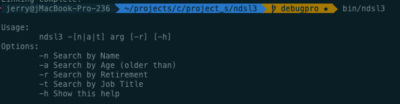
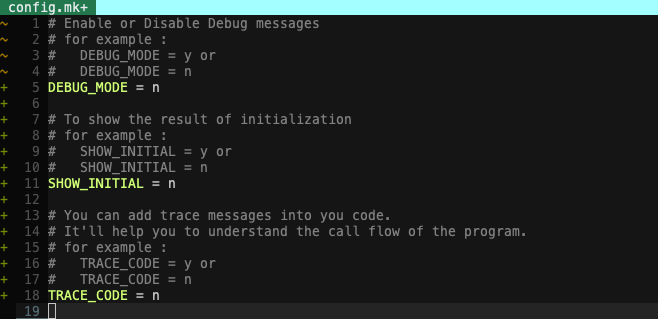

# Project S
## ndsl
- Basic C pointer operations
- C typedef usage
- How to use C macro
## ndsl2
- Conditional compilation
## ndsl3
- Rewrite the initialization
- Refactoring practice
- How to use void function pointer
- Build up debugging messages
- Revise makefile for general use

Enter into the ndsl4 foler and run the binary, for example :
    bin/ndsl3 -n Jerry
    bin/ndsl3 -n "Jerry Kuo"
    bin/ndsl3 -a 30
    bin/ndsl3 -r
    bin/ndsl3 -t professor

## ndsl4
- Advanced debugging messages
- Add config.mk to control the definition of makefile

